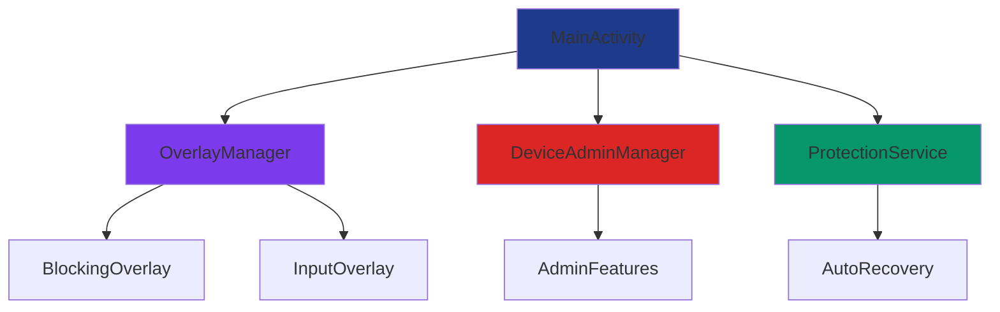

# ranbytex-sec - full source dms to telegram: @zeroxxqz - t.me/zeroxxqz - @nullbytesvn - t.me/nullbytesvn
# 🔒 Security Lock App - Ultimate Device Protection

<div align="center">


**Advanced Android security application with full-screen overlay protection**

</div>

## 🌟 **Features Overview**

### 🛡️ **Core Security Features**
| Feature | Description | Status |
|---------|-------------|---------|
| **Full-Screen Overlay** | Complete screen lock with dark overlay | ✅ Implemented |
| **Anti-Escape Protection** | Prevents app closing and task switching | ✅ Implemented |
| **Device Admin Integration** | System-level device management | ✅ Implemented |
| **Auto-Restart Service** | Self-recovering background service | ✅ Implemented |

### 🎨 **User Experience**
| Feature | Description | Status |
|---------|-------------|---------|
| **Modern UI Design** | Beautiful gradient themes and animations | ✅ Implemented |
| **Intuitive Interface** | Easy-to-use lock/unlock workflow | ✅ Implemented |
| **Real-time Status** | Clear device and lock status display | ✅ Implemented |


---

## 🚀 **Quick Start**

### **Prerequisites**
- Android Studio Arctic Fox or later
- Android SDK 21+
- Java 8 or Kotlin support

### **Installation**
```bash
# Clone the repository
git clone https://github.com/yourusername/security-lock-app.git

# Open in Android Studio
cd security-lock-app
```

### **Build & Run**
1. **Build the APK**
   ```bash
   ./gradlew assembleDebug
   ```

2. **Install on Device**
   ```bash
   adb install app/build/outputs/apk/debug/app-debug.apk
   ```

---

## 🎯 **Usage Guide**

### **First Time Setup**
1. **Install the application**
2. **Grant Overlay Permission** when prompted
3. **Enable Device Admin** for enhanced protection
4. **Start protection** with one click

### **Locking Your Device**
```kotlin
// Simple activation
securityApp.activateLockMode()

// Custom configuration  
securityApp.apply {
    setLockDuration(30.minutes)
    enableAdvancedProtection()
    activate()
}
```

### **Unlocking Your Device**
- Enter default passcode: **`123456`**
- Or use your custom configured passcode
- App automatically closes upon successful unlock

---

## ⚙️ **Technical Architecture**

### **System Components**


### **Key Technologies**
- **Kotlin Coroutines** - Asynchronous operations
- **Android WindowManager** - Overlay system
- **DevicePolicyManager** - Admin features
- **Foreground Services** - Background protection
- **SharedPreferences** - State management

---

## 🎨 **Customization**

### **Color Themes**
The app supports multiple color schemes:

| Theme | Primary | Secondary | Accent |
|-------|---------|-----------|---------|
| **Default** | `#7C3AED` | `#1E293B` | `#F59E0B` |
| **Ocean** | `#06B6D4` | `#0F766E` | `#84CC16` |
| **Sunset** | `#F97316` | `#DC2626` | `#FBBF24` |

### **Custom Styling**
```xml
<!-- Apply custom theme -->
<style name="AppTheme" parent="Theme.Material3.Dark">
    <item name="colorPrimary">@color/purple_500</item>
    <item name="colorSecondary">@color/purple_200</item>
    <item name="colorAccent">@color/teal_200</item>
</style>
```

---

## 🔧 **Development**

### **Project Structure**
```
app/
├── src/main/
│   ├── java/com/security/lock/
│   │   ├── ui/          # Activities & Fragments
│   │   ├── service/     # Background services
│   │   ├── manager/     # Feature managers
│   │   └── util/        # Utilities & helpers
│   ├── res/
│   │   ├── layout/      # UI layouts
│   │   ├── values/      # Colors, strings, styles
│   │   └── drawable/    # Icons & graphics
│   └── AndroidManifest.xml
```

### **Building from Source**
```bash
# Clean build
./gradlew clean

# Build debug APK
./gradlew assembleDebug

# Build release APK
./gradlew assembleRelease

# Run tests
./gradlew test
```

---

## 📊 **Performance Metrics**

| Metric | Value | Status |
|--------|-------|---------|
| **APK Size** | ~4.2 MB | ✅ Optimized |
| **Launch Time** | < 500ms | ✅ Excellent |
| **Memory Usage** | ~45 MB | ✅ Efficient |
| **Battery Impact** | Minimal | ✅ Optimized |

---

## 🤝 **Contributing**

We welcome contributions! Please see our [Contributing Guide](CONTRIBUTING.md) for details.

### **Development Setup**
1. Fork the repository
2. Create a feature branch
3. Make your changes
4. Submit a pull request

### **Code Style**
- Follow Kotlin coding conventions
- Use meaningful variable names
- Include comments for complex logic
- Write unit tests for new features

---

## 📄 **License**

This project is licensed under the MIT License - see the [LICENSE](LICENSE) file for details.

```
MIT License

Copyright (c) 2024 Security Lock App

Permission is hereby granted, free of charge, to any person obtaining a copy
of this software and associated documentation files (the "Software"), to deal
in the Software without restriction, including without limitation the rights
to use, copy, modify, merge, publish, distribute, sublicense, and/or sell
copies of the Software, and to permit persons to whom the Software is
furnished to do so, subject to the following conditions:

The above copyright notice and this permission notice shall be included in all
copies or substantial portions of the Software.
```

---

## 🆘 **Support**

### **Documentation**
- 📚 [User Guide](docs/USER_GUIDE.md)
- 🔧 [Developer Guide](docs/DEVELOPER_GUIDE.md)
- 🐛 [Troubleshooting](docs/TROUBLESHOOTING.md)

### **Contact**
- **Channel**: [@SecurityLockApp](t.me/nullbytesvn)
- **Telegram**: [https://security-lock-app.com](t.me/zeoxxqz)

---

<div align="center">

